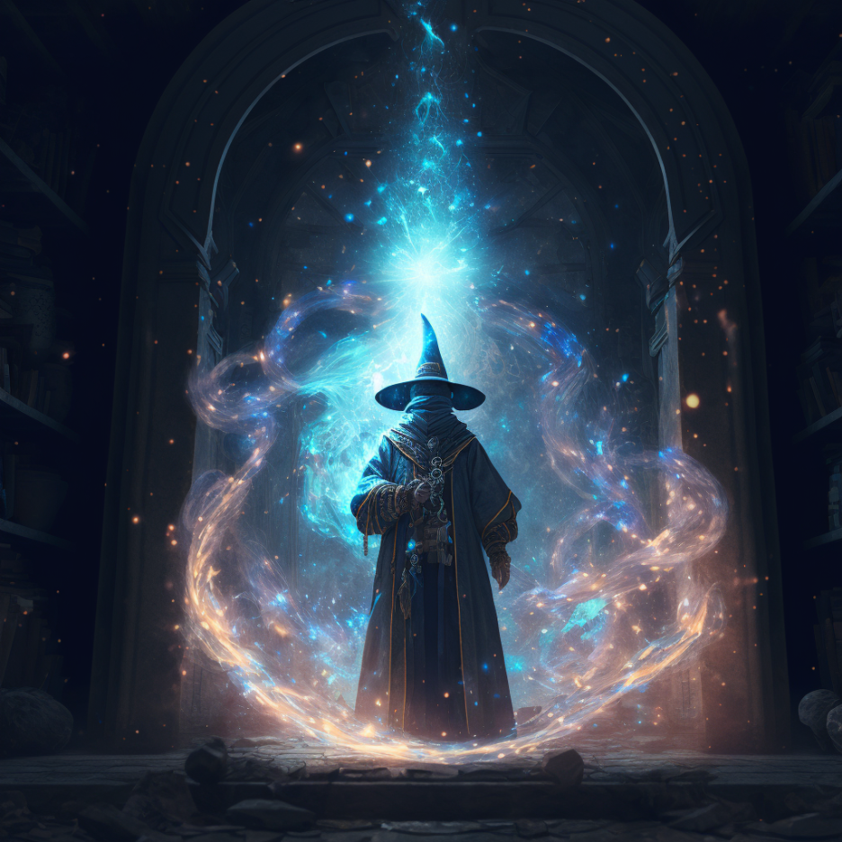

# abi-guesser-rs • [](https://github.com/zkSoju/abi-guesser-rs/actions/workflows/tests.yaml) [](https://github.com/zkSoju/abi-guesser-rs/actions/workflows/lints.yaml)  

Rust adaptation of Samczsun's [Abi Guesser](https://github.com/samczsun/abi-guesser)

## Getting Started

Click `use this template` on [Github](https://github.com/zkSoju/abi-guesser-rs) to create a new repository with this repo as the initial state.

## Blueprint

```ml
assets
├─ embedded documentation images
example
├─ src
│  └─ lib.rs — Example Rust Library
├─ Cargo.toml — Library Cargo Manifest
Cargo.toml — Workspace Cargo Manifest
```

## Development

TODO

## License

[THE UNLICENSE](https://github.com/zkSoju/abi-guesser-rs/blob/master/LICENSE)
